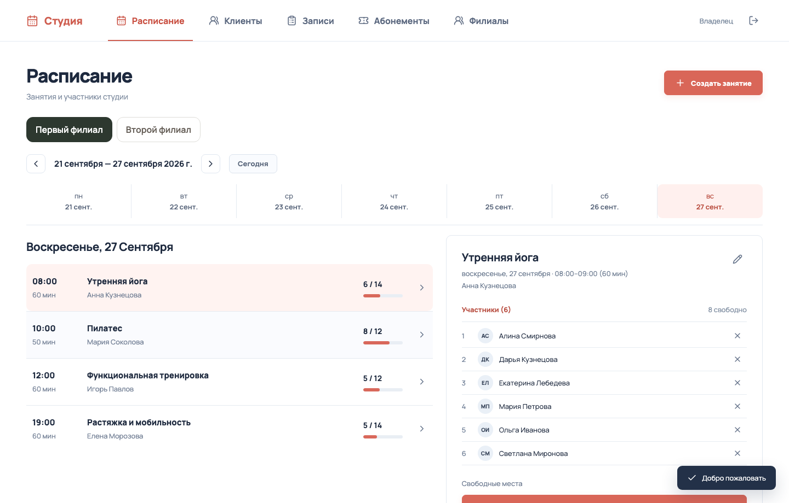
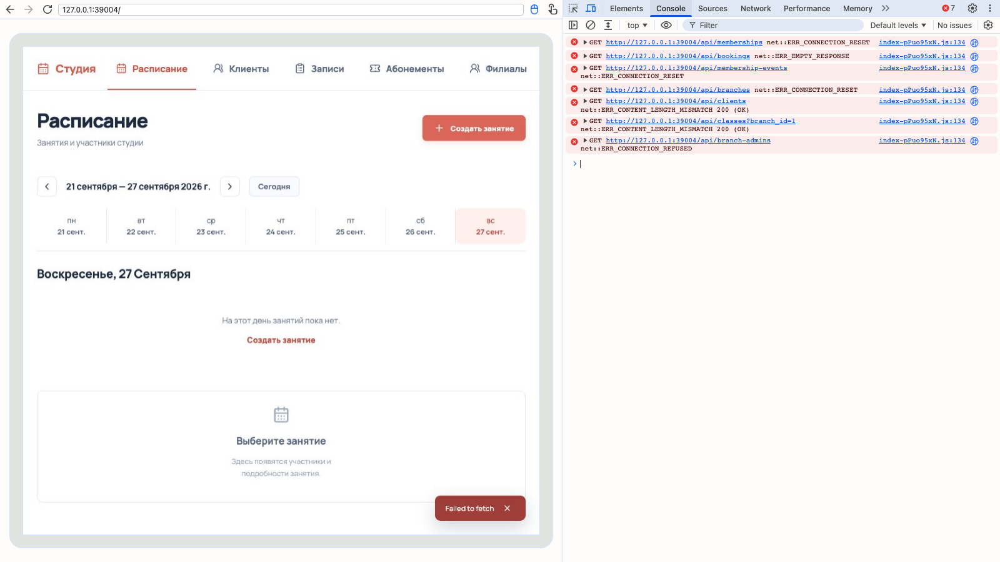

<div align="center">
  <h1>Classly · студия, собранная вайбкодингом</h1>
  <p>Эксперимент: как далеко можно зайти, если делать приложение почти целиком через промпты?</p>
  <p><a href="https://youtu.be/IIIDSTnYDQA"><strong>▶ Смотреть видео</strong></a></p>
</div>



Classly — демо-приложение для студии групповых занятий. Здесь есть расписание двух филиалов, клиенты, записи и абонементы; владелец и администраторы управляют занятиями. Я собирал проект через вайбкодинг: описывал задачи, запускал полученный код, исправлял ошибки и постепенно добавлял функции.

С первого взгляда всё выглядит как готовый сервис: интерфейс есть, данные сохраняются, основные сценарии работают. В этом и был смысл эксперимента — проверить на практике обещание «описал идею словами и быстро получил приложение». Для прототипа подход оказался полезным. Но с каждой новой функцией всё важнее становилось понимать, как устроен проект целиком: одну задачу можно решить несколькими рабочими способами, а последствия такого выбора проявятся позже, когда код понадобится менять или масштабировать.

Даже при локальном запуске удалось воспроизвести сбой загрузки: вместо занятий приложение показало пустое расписание, а в консоли появились ошибки запросов. Так выглядела одна из проблем, которые обнаружились при проверке проекта:



Такой сбой хорошо показывает главную мысль эксперимента. Вайбкодинг помогает быстро собрать и проверить идею, но для большого проекта одного работающего интерфейса мало. Чтобы развивать продукт, нужно самому понимать код, движение данных и архитектуру — инструмент не примет эти решения за разработчика. Classly остаётся учебным прототипом, а не готовым сервисом для реальных клиентских данных.

## Запустить локально

Установите Node.js, затем выполните:

```bash
npm ci
cp .env.example .env
```

В `.env` укажите `ADMIN_EMAIL` и `OWNER_PASSWORD_HASH`. Хеш пароля можно получить так:

```bash
node -e "console.log(require('bcryptjs').hashSync('ваш-пароль', 12))"
```

Заключите хеш в `.env` в одинарные кавычки, чтобы сохранить символы `$`, и запустите приложение:

```bash
npm run dev
```

Откройте `http://localhost:5173`. Данные хранятся локально в SQLite. Проверки: `npm test` и `npm run build`.

**Как собирался Classly, какие ещё проблемы вскрылись и почему они важны — [смотрите в видео](https://youtu.be/IIIDSTnYDQA).**
